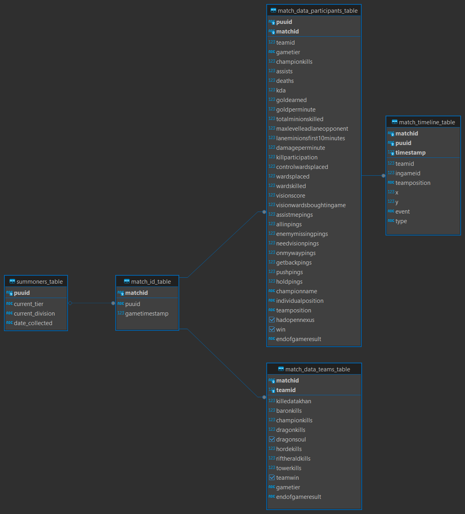
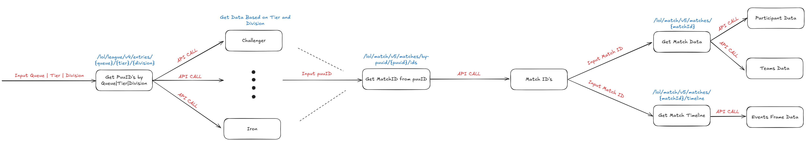

# 🧩 League of Legends Data Pipeline

- **Status**: Completed
- **Purpose**: Automated, configurable data pipeline for fetching, filtering, and storing _League of Legends_ match data using Riot's official API.
- **Additional Advanced Features to be Added in the Future**:
  - A class that will include functions to fetch data from the tables based on the desired parameters

---

## 🔍 Overview

This repository contains a modular, rate-limited, and well-logged data pipeline built around the [Riot Games API](https://developer.riotgames.com/). It automates the process of:

- Retrieving ranked match data across tiers and roles
- Filtering relevant events and timelines
- Storing structured results in a local SQLite database
- Preparing clean datasets for statistical analysis and machine learning

---

## 🏗️ Folder Structure

<pre>

League-of-Legends-data-pipeline/
├── data/
├── log_config/
│   ├── log_config.json
├── logs/
├── notebooks/
│   ├── playground.ipynb
├── src/
│   ├── __pycache__/
│   ├── data_collection/
│   │   ├── __ini__.py
│   │   ├── riot_api.py
│   ├── pipeline/
│   │   ├── __init__py
│   │   ├── pipeline_workflow.py
│   ├── processing/
│   │   ├── __init__.py
│   │   ├── LoLDatabaseQuery.py
│   ├── riot_key_folder/
│   │   ├── __init__.py
│   │   ├── config_template.json
│   │   ├── riot_api_key.py
│   ├── RiotAPI_Processing_Functions.egg-info/
│   ├── __init__.py
├── .gitignore
├── photos/
│   ├── API_Call_Workflow.png
│   ├── Database_Tables_Relationships
├── documentation.txt
├── pipeline_configuration
├── main.py
├── README.md
├── setup.py
</pre>

---

## 🗃️ Database Schema

# 🔁 API Call Workflow

## Overview

This workflow describes fetching and storing League of Legends match data through Riot Games' API.

## Workflow Steps

### 1. Input Queue, Tier, Division

- **Input**: Competitive tier (e.g., Challenger, Iron), queue (e.g., ranked, normal), and division (e.g., I, II)
- **API Call**: `/lol/league/v4/entries/{queue}/{tier}/{division}`
- **Action**:
  - Retrieve summoner entries for each tier and division (ranked)
  - Store data in SQL database

### 2. Get Match IDs from puuIDs

- **Fetch**: puuID from the database
- **API Call**: `/lol/match/v5/matches/by-puuid/{puuid}/ids`
- **Action**:
  - Get the list of recent match IDs for each player
  - Store data in an SQL database

### 3. Get Match Data

- **Fetch**: matchID from the database
- **API Call**: `/lol/match/v5/matches/{matchId}`
- **Extract**:
  - Participant-level data
  - Team-level data

### 4. Get Match Timeline

- **Fetch**: matchID from the database
- **API Call**: `/lol/match/v5/matches/{matchId}/timeline`
- **Extract**:
  - Events data
  - Frame-by-frame gameplay data

## ⚙️ Features

### 🔗 Riot API Interface (`riot_api.py`)

- Interacts with Riot’s Match-V5, Summoner-V4, and Spectator-V4 endpoints
- Fetches player PUUIDs, match histories, and timelines
- Implements robust error handling and rate limit compliance

### 🧠 Pipeline Controller (`pipeline_workflow.py`)

- End-to-end orchestration of:
  - Player and match data retrieval
  - Timeline extraction
  - Filter application and database storage
- Enables batch collection and control over sample size and rank tier

### 🧼 Filtering Module (IN PROGRESS)

- TBD

### 🧱 Database Integration (`riot_data_database.db`)

- Lightweight SQLite database setup
- Stores structured data across:
  - Match metadata
  - Participant performance
  - Event sequences and timelines

### 🪵 Logging System (`logs/riot_data.log`)

- Tracks request success/failure and error messages
- Useful for debugging long pipeline runs
- Controlled via `configs/log_config.json`

---

## 🧪 How to Run

### Installation

To install the RiotAPI Processing Functions locally, follow these steps:

Clone the repository:

<pre>
  git clone https://github.com/PadTo/League-of-Legends-data-pipeline.git
  cd League-of-Legends-data-pipeline
</pre>

Run the following command to install the package locally:

<pre>
  pip install .
</pre>

Make sure you're in the root directory of the project (where setup.py is located) before running the install command.

### ⚙️ Configure the Pipeline

Edit the pipeline_configuration.json file located in the project root. This file contains all runtime settings required by the pipeline:

EXAMPLE:

<pre>
{
  "database_save_location": "YOUR/DESIRED/DATA/PATH",
  "logging_configuration_filepath": "YOUR/DESIRED/LOG_CONFIG_PATH/log_config.json",
  "stages_to_process": [0, 1, 0, 0], 
  "rate_limit": -1,
  "region": -1,
  "page_limit": -1,
  "event_types_to_consider": -1,
  "batch_insert_limit": 3,
  "players_per_tier": 5,
  "matches_per_tier": 100,
  "day_limit": 12
}
</pre>

⚠️ CONFIGURATION EXPLANATION:

database_save_location:

- Description: Path where processed data will be saved (e.g., a .db or .sqlite file).
- Example: "D:\\LoL Analysis Project\\data"
- Ensure the folder exists or the program has permission to create it.

logging_configuration_filepath:

- Description: Path to the logging config file (JSON format).
- Controls: What to log, log levels, format, output files, etc.
- Example: "D:\\LoL Analysis Project\\log_config\\log_config.json"

stages_to_process:

- Description: A list of 4 binary values [1, 1, 1, 1] to toggle pipeline stages.
  - 1 = run the stage
  - 0 = skip the stage
- Example: [1, 0, 0, 1] runs stages 1 and 4.
- Dependency rules:
  - Stage 2 depends on stage 1
  - Stage 3 depends on stage 2
  - Stage 4 depends on stage 3

rate_limit:

- Description: API rate limit (format: [calls, seconds]) or -1 for default/no limit.
- Example: [100, 120] = 100 requests allowed per 120 seconds.

region:

- Description: Riot API region URL to query from.
- Allowed: Only European regions (e.g., "https://eun1.api.riotgames.com")
- Invalid or unsupported regions will break the pipeline.

page_limit:

- Description: Max number of pages of match data fetched per tier/division in stage 1.
- Example: 2 = fetch up to 2 pages per bracket.
- -1 disables the limit (fetch all available pages).

event_types_to_consider:

- Description: Filters which event types to extract from match timelines.
- Example: ["CHAMPION_KILL", "BUILDING_KILL"]
- Use -1 to include all default event types.

batch_insert_limit:

- Description: Max number of entries inserted into the database at once.
- Prevents RAM issues and improves performance.
- Example: 3 = insert 3 records per batch.

players_per_tier:

- Description: Number of players to consider per tier.
- Example: 5 = fetch data for 5 players per tier.

matches_per_tier:

- Description: Number of full matches to load and process per tier.
- Can be absolute (e.g., 100) or proportional (e.g., 0.25 = 25%).
- -1 processes all available data.

day_limit:

- Description: Restricts data to matches played within the last N days.
- Example: 30 = only process matches from the last 30 days.
- -1 disables this limit and defaults to 12 days.
  """

### Run the Main Script

python main.py

When you run the file, you will be prompted to input your Riot API key. You can choose to replace it or skip it.

<pre>
  Do you want to replace the API key (Y for YES | N for NO)?
  If you type Y, you'll be prompted to enter your Riot API key:
</pre>

Once the key is entered, the pipeline will start and begin processing data.

NOTE:

- The collection process takes a long time (Hours) due to rate limiting (rate limits can be adjusted based on your needs and account constraints related to rates)
- The data WILL NOT be uploaded due to the database having millions of entries
- If the pipeline's API calls have request code 400 even though the API key is valid, re-generating the key might fix the problem
