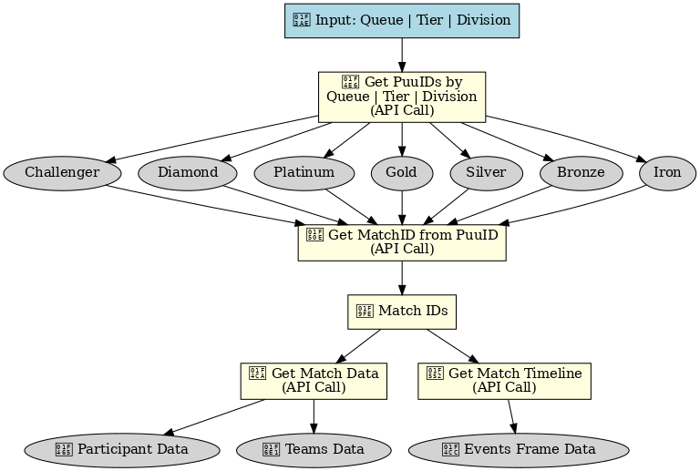

# 🧩 League of Legends Data Pipeline

> **Status**: In Development  
> **Purpose**: Automated, configurable data pipeline for fetching, filtering, and storing *League of Legends* match data using Riot's official API.

---

## 🔍 Overview

This repository contains a modular, rate-limited, and well-logged data pipeline built around the [Riot Games API](https://developer.riotgames.com/). It automates the process of:

- Retrieving ranked match data across tiers and roles
- Filtering relevant events and timelines
- Storing structured results in a local SQLite database
- Preparing clean datasets for statistical analysis and machine learning

---

## 🏗️ Folder Structure

<pre>

LoL_Analysis_Project/
├── data/
│   ├── riot_data_database.db
├── log_config/
│   ├── log_config.json
├── logs/
├── notebooks/
├── src/
│   ├── __pycache__/
│   ├── data_collection/
│   │   ├── __ini__.py
│   │   ├── riot_api.py
│   ├── pipeline/
│   │   ├── __init__py
│   │   ├── pipeline_workflow.py
│   ├── processing/
│   │   ├── __init__.py
│   │   ├── response_filters.py
│   ├── riot_key_folder/
│   │   ├── __init__.py
│   │   ├── config_template.json
│   │   ├── riot_api_key.py
│   ├── RiotAPI_Processing_Functions.egg-info/
│   ├── __init__.py
├── .gitignore
├── photos/
│   ├── API Call Workflow.png
├── documentation.txt
├── main.py
├── README.md
├── setup.py
</pre>
---

## 🔁 API Call Workflow Overview

1. **Input Queue, Tier, Division**  
   → Selecting competitive tier (e.g. Challenger, Iron), queue (e.g. ranked, normal), and division (e.g. I, II)
   → Call `/lol/league/v4/entries/{queue}/{tier}/{division}`  
   → Retrieve summoner entries for each tier and division (ranked).
   → Store data in an SQL database.
   
2. **Get Match IDs from puuIDs**  
   → Fetch the puuID from the database.
   → Call `/lol/match/v5/matches/by-puuid/{puuid}/ids`  
   → Get list of recent match IDs for each player.
   → Store data in an SQL database.
   
3. **Get Match Data**  
   → Fetch the matchID from the database.
   → Call `/lol/match/v5/matches/{matchId}`  
   → Extract **participant** and **team** level data.

4. **Get Match Timeline**  
   → Fetch the matchID from the database.
   → Call `/lol/match/v5/matches/{matchId}/timeline`  
   → Get **events** and **frame-by-frame** gameplay data.

## ⚙️ Features

### 🔗 Riot API Interface (`riot_api.py`)
- Interacts with Riot’s Match-V5, Summoner-V4, and Spectator-V4 endpoints
- Fetches player PUUIDs, match histories, and timelines
- Implements robust error handling and rate limit compliance

### 🧠 Pipeline Controller (`pipeline_workflow.py`)
- End-to-end orchestration of:
  - Player and match data retrieval
  - Timeline extraction
  - Filter application and database storage
- Enables batch collection and control over sample size and rank tier

### 🧼 JSON Filtering Module (`processing/response_filters.py`)
- Extracts:
  - Key game events (kills, dragons, barons, towers)
  - Player stats and item builds
  - Timeline information for positional or time-based analyses

### 🧱 Database Integration (`riot_data_database.db`)
- Lightweight SQLite database setup
- Stores structured data across:
  - Match metadata
  - Participant performance
  - Event sequences and timelines

### 🪵 Logging System (`logs/riot_data.log`)
- Tracks request success/failure and error messages
- Useful for debugging long pipeline runs
- Controlled via `configs/logging_config.yaml`

---

## 🧪 How to Run

```bash

